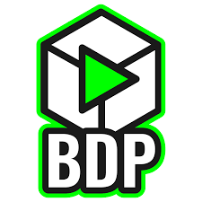
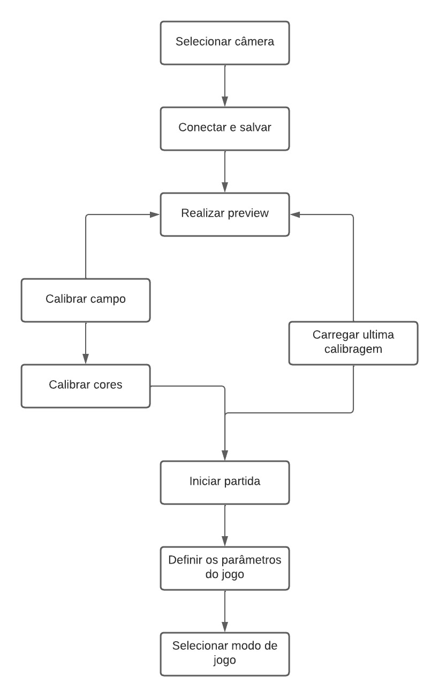

# Plataforma BDP Soccer
O BDP – Believe, Do and Play é a equipe de robótica da Universidade Federal de Viçosa. A plataforma é composta por diversas classes que compõe o escopo principal a ser executado ao longo das competições Very Small Size League (VSSL) pela equipe do BDP Soccer.

  

## Desenvolvimento
O código principal abre uma janela que será usada para calibrar e executar as classes que estão condicionadas ao main da plataforma. O desenvolvimento foi feito usando a linguagem Python e algumas bibliotecas de auxílio para o processamento de imagens(OpenCV), interface gráfica(tkinter), operações com listas e matrizes(Numpy), entre outras que são encontradas no arquivo "requirements.txt".

## Requisitos
Para executar o código principal é necessário que todas as bibliotecas estejam instaladas. Para isso, instale todos as dependências presentes em "requirements.txt". Linha de instalação feita no Windows pelo VSCode:

    pip install -r 'requirements.txt'

## Classes
As classes permitem organizar o código promovendo a reutilização, manutenção e torna o código mais legível.

### Camera
Destinada desenvolver o script destinado para as funções relacionadas à câmera. Nas competições, a câmera é usada para capturar o jogo em tempo real, portanto é preciso configurar o vídeo que é recebido da câmera para que seja possível segmentar as cores do uniforme, o campo, a bola, posicionamento dos jogadores entre outros.

### Campo
Tem como como objetivo desenvolver o script para as funções relacionadas à calibração do campo. O campo de jogo é calibrado de forma a se obter suas dimensões, pontos específicos  e correlacionar os pontos do campo real com o "virtual".

### Cores
É feito a segmentação de cores de que serão usadas na competição. As cores possuem finalidades de diferenciar os times, detectar a bola, definir as funções dos jogadores. Para se obter melhores resultados, são feitas calibrações para diminuir ruídos.

### PDI
O processamento digital de imagens é implementado na Plataforma do BDP para extração e manipulação de imagens digitais ao longo das competições e testes realizados em laboratório. Principais usos são para melhoramento, segmentação e processamento em tempo real das imagens.

### Controle
Implementada para controle dos jogadores de linha e goleiro. Além disso, é responsável por definir funções de controle pelo joystick, geralmente usado para testes de controle mecânico do robô.

### Main
O código principal é condicionado a todas as classes anteriormente definidas. Sua execução abre uma janela virtual onde as classes são calibradas e é feito o acompanhamento em tempo real da partida.

## Fluxograma
Abaixo está o fluxograma de ações que são executadas na janela principal para que a partida seja habilitada com sucesso.

  

